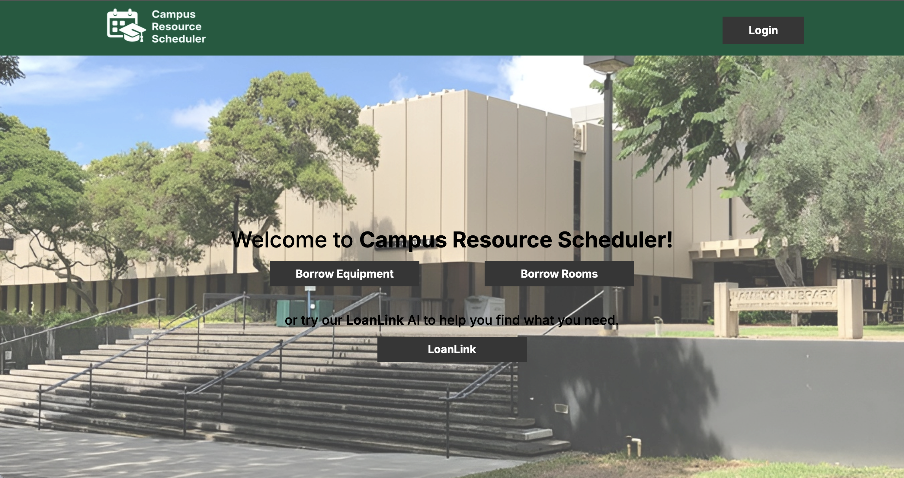

## Team Contract

You can access our team agreed team contract here:

[https://docs.google.com/document/d/1dpHfMn3FyFn8EcrtqpR5pqBB7FA7-DTHXISeKFNhwgE/edit?usp=sharing](https://docs.google.com/document/d/1dpHfMn3FyFn8EcrtqpR5pqBB7FA7-DTHXISeKFNhwgE/edit?usp=sharing)


## Deployment with Vercel

To make Campus Resource Scheduler easily accessible to the UH Mānoa community, we’ve deployed our application using Vercel, a powerful platform for frontend frameworks and static sites. Vercel streamlines the deployment process, offering continuous integration with GitHub and automatic updates every time changes are pushed to the main branch.

With Vercel, our team is able to:
- Deploy new features quickly with minimal setup
- Preview changes via deployment previews
- Scale efficiently to accommodate traffic from students and administrators

## Live Website

You can access the deployed Campus Resource Scheduler here:
[https://campus-resource-scheduler-project.vercel.app/](https://campus-resource-scheduler-project.vercel.app/)

Feel free to explore the features we’ve implemented, from equipment and room scheduling to AI-powered recommendations. This platform aims to improve how UH Mānoa students discover and access the campus resources they need.

## Project Overview 

As a fellow student attending the University of Hawaiʻi at Mānoa, I have often wished for a piece of equipment I needed for one of my classes, a private room for a study group, or another student that could benefit from my old material used in past computer science classes. Glancing at the ideas proposed in the final project brainstorm outline, my group and I knew we could add a new fundamental website project designed to help UH Mānoa students obtain common campus resources. Therefore, we propose **Campus Resource Scheduler** as our final ICS 314 project.

### The Problem

As students attend their everyday classes at UH Mānoa, they may forget to bring an important piece of equipment once or twice, such as a mouse, earbuds, pencil, or even a laptop to a specific place. Students may also want specialized technology for a few important occasions such as a significant meeting, challenging recitation, or crucial exam, but do not know where to go to obtain them. Additionally, students may want a specialized room or lab to study, conduct work, or work on projects, but they cannot find such a place easily.

### The Solution

As a web project centered around the UH Mānoa community, the **Campus Resource Scheduler** seeks to solve these problems by providing a central hub where common campus resources, rooms, and labs can be lent out to those in need of these resources. Students can choose between what kind of resource they would like to receive for a set duration of time, regulated by the usage of accounts for authentication. Students will be able to see what resources and rooms are available or not as they access the website and return resources for community use.

## Special Sauce

As users decide what item to request or what room to schedule to fit their needs, an AI-powered algorithm can be added to recommend specific resources that are available to students. The user can also give the AI custom message requests and receive recommendations from that request. Using natural language processing and machine learning, the AI can process the user's custom message request and generate a response and recommendation based on that specific request. AI will also be able to gather information from the student's profile from profile creation, classify the user based on their profile, and generate a custom dashboard that displays available items/rooms for scheduling. The AI will only choose available resources, and also gives advice on how to use specific resources to users who may be considering scheduling the resources.

## Mockup Page Ideas

This project will be structured similarly to a renting/borrowing website with a central authority that manages what items can be borrowed and who can borrow them. 

**Roles:** 
Users will be able to log into the website, browse the directory for resources that are relevant to them through a specialized search function, and reserve items or rooms for later pick up and use. 
Site Admins will be able to monitor the users that log into the website, see what resources they have used and borrowed, manage who can borrow what item, and add additional functionality to the website itself.

**Components:**
There will be 2 main categories for equipment and physical spaces. These 2 main categories will also have their own subcategories based on types such as electronics for equipment or labs for physical spaces. Users will be able to choose what specific resource they would like to schedule for a set amount of time and filter various resources based on relevance and availability. The users can receive confirmation messages and update them via their school email. Photos will be provided of all the resources for a friendlier user experience. Website administrators will be able to modify all of these components to fit the needs of the community, as well as make modifications based on real-life updates at UH Mānoa.

**Possible Mockup Pages:**
- Landing Page
- User Home Page
- User Profile Page
- Website Introduction Page
- Equipment Page
- Borrow Equipment Page
- Return Equipment Page
- Rooms/Labs Page
- Rent Rooms/Labs Page
- Return Rooms/Labs Page
- Admin Home Page
- Configure Resources Page

## Use Case Ideas

An end-to-end scenario of using the system:
- New user enters the landing page, sign up, log into the system, and set up their profile.
- New user learns how to use the site through a introductory page they encounter before scheduling resources.
- User searches for specific items/rooms based on their needs.
- User schedules item/room successfully and receives a confirmation message and instructions for pickup.
- Admin enters landing page, logs into the system, and monitors website activity.
- Admin modifies the availability of specific items/rooms based on current events.

## Page Mockups

The following 5 page mockups will display the main functionality of the application.

### Home Page:

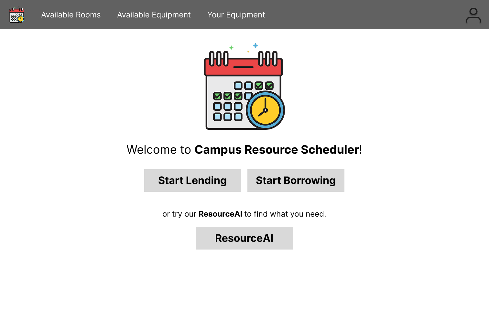

**Campus Resource Scheduler** will have a home page displaying the main functions of the website: browsing available rooms, browsing available equipment, looking over the equipment a user has already borrowed, or conversing with the ResourceAI to find recommendations for helpful items for specific users. 

### Profile Page:

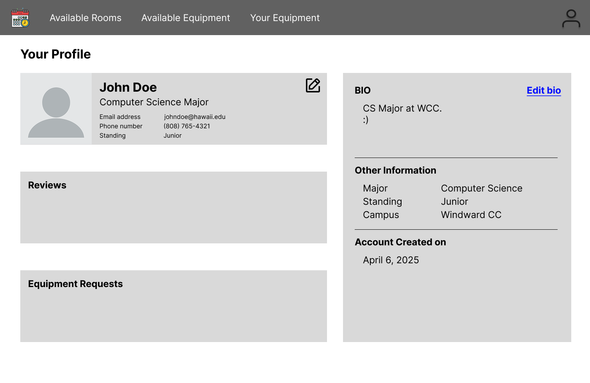

The profile page for each user can be customized to show their contact information, biography, home campus, class standing, resource reviews, and things they have borrowed. 

### Available Equipment Page:

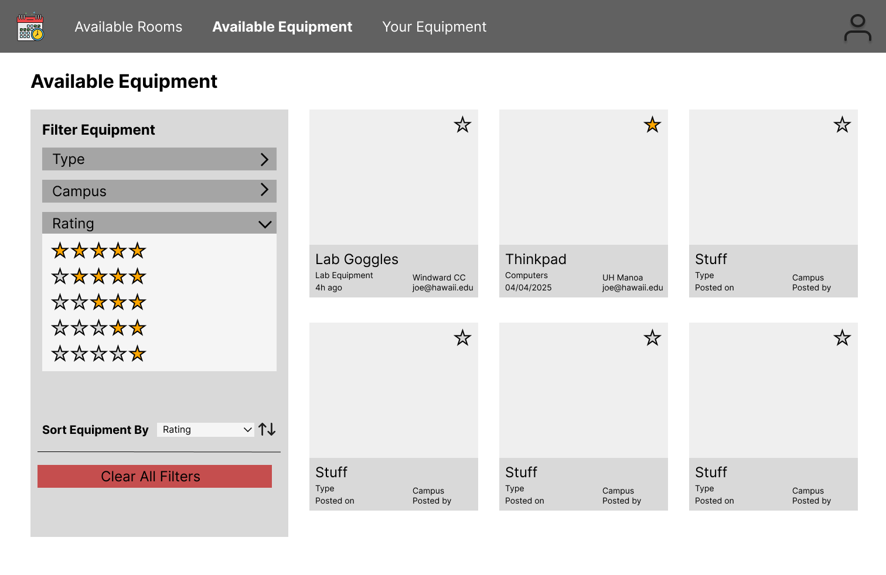

The equipment page of the application is the central hub for all physical resources of the application. Here, users can browse what specific items they may need and also sort items based on relevance, campus, and rating.

### Available Rooms Page:

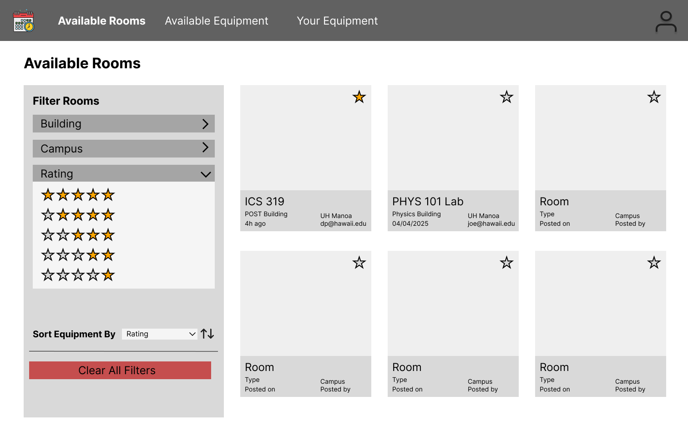

Like the equipment page, the rooms page is the central hub for all locational resources of the application, Here, users can browse what specific rooms they may need for their occasion and also sort rooms based on location, campus, and rating.

### Your Equipment Page:

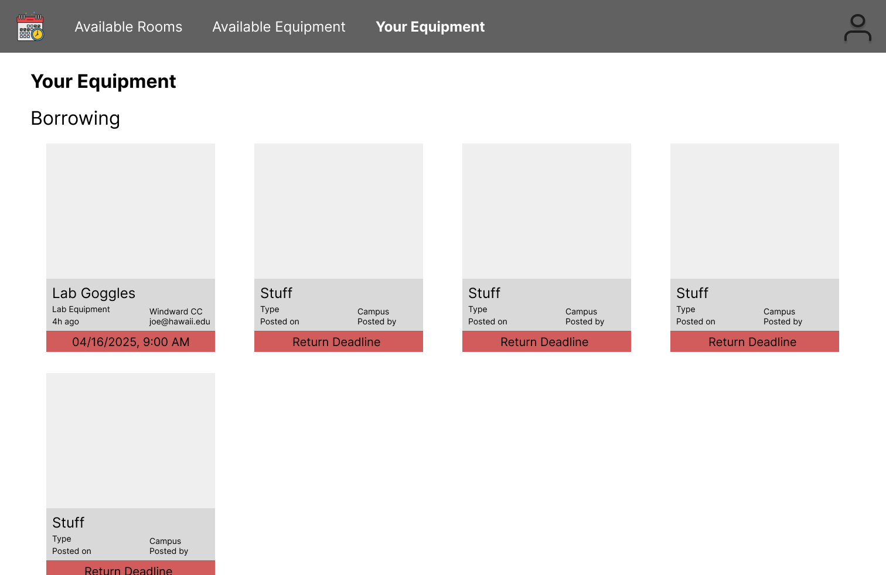

This page is the informational panel for users who are currently borrowing physical equipment or in-person spaces at any particular campus. Here, users can see what resources they are borrowing, its type, and its return deadline. 

# Overview

Welcome to the documentation of the Campus Resource Scheduler application! As a part of the UH community, this project team wanted to solve a problem common to all students attending school on a UH campus - where to borrow a resource that they will need for some time? The Campus Resource Scheduler or CRS application aims to solve this problem by providing a central hub of both physical resources and locational resources to any UH community member who may need it for a set time. This system stores an online database of available resources that users can choose from, pick up at a specified location, and return to the same location. 

Many applications of the CRS apply to the everyday lives of UH community members. Individuals who forgot to bring an important piece of equipment such as a writing utensil can use the CRS to quickly and easily borrow that piece of equipment for use and return it later. Additionally, individuals who may be going to a special or important event such as an exam can also use the CRS to retrieve an essential resource that they need for that event. Furthermore, physical spaces such as study rooms and labs are also covered by the CRS, so that UH community members who are looking for a space to complete a particular task can effortlessly rent the space for a set period of time. The CRS at its core aims to serve the UH community through providing an easy-to-use interface for borrowing all sorts of items related to academic life.

Users who engage with the CRS application will be able to customize their profile, quickly search for relevant resources to borrow, and see all the relevant details that are attributed to each resource, such as category, location, campus, appearance, and the date that it was made available. The user will also be able to filter through all of these classifications and find the resource that they most need. Additionally, there is a helper AI chatbot that will direct the user towards relevant resources to borrow based on their profile and what the user needs at that time. On the whole, the Campus Resource Scheduler will be able to suit the needs of any UH community member who is looking for a specific campus resource.

# User Guide

This section provides a detailed walkthrough of the Campus Resource Scheduler user interface, its pages, and its functionalities.

### Landing Page

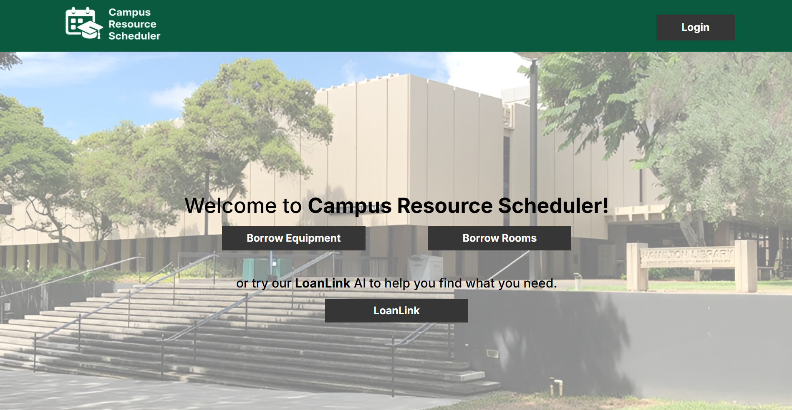

The landing page is presented to everyone who visits the top-level URL to the website. Here the website displays some of its features to those who have not signed in yet.

### Sign Up and Sign In Pages

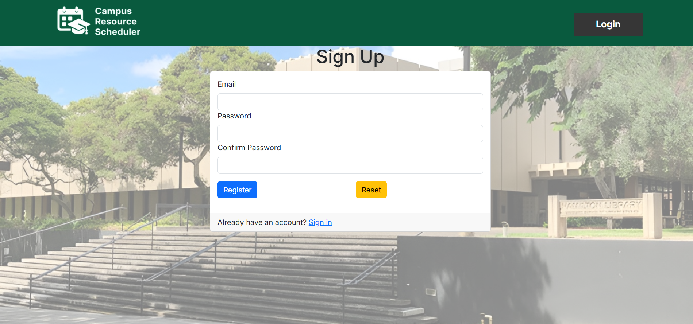

If a new user is accessing the website, they have the option to register as a new user by clicking the "Login" button in the upper right corner of the page, clicking "Sign Up", registering their email address, and deciding on a password. 

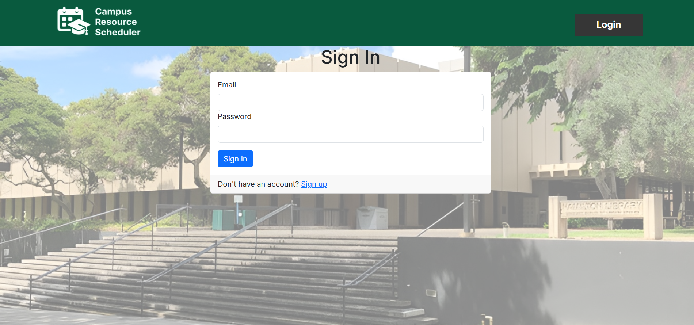

If an existing user is accessing the website, they can sign in to the website by clicking the "Login" button in the upper right corner of the page, clicking "Sign In", entering their email address, and inputting their password. 

### Home Page

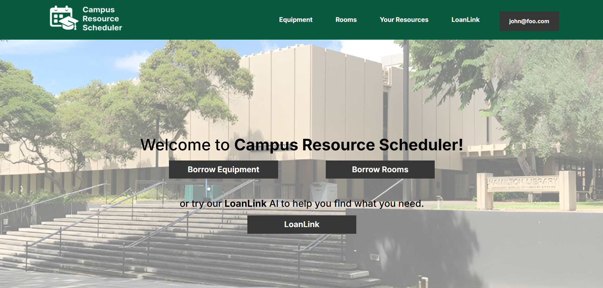

Once the user logs in, they will have more options presented to them. They will be able to choose between borrowing equipment, borrowing rooms, looking at what resources they have borrowed, or using the AI chatbot focused on helping them find the right resource. The home page contains a short tutorial on all of the functionality of the website as well as feature a few resources that were recently made available on the website. The home page also displays 3 resources that were made recently available.

### Equipment Page

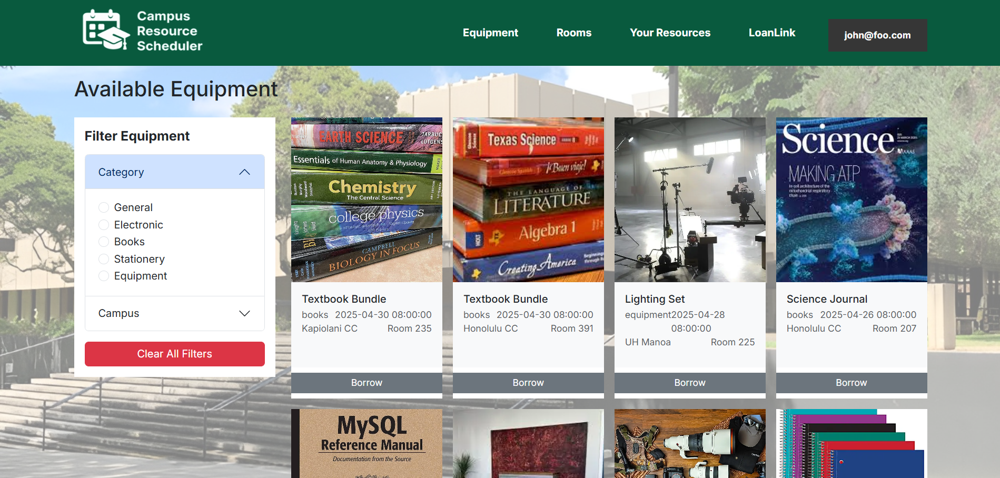

If the user wants to borrow a physical resource, clicking on the "Equipment" tab in the navbar will bring them to a page containing all available physical equipment. Each physical resource contains important information such as category, posted date, campus, and room. The user will also be able to filter the available physical equipment by campus and by category. To borrow a physical resource, the user can click the "Borrow" button the bottom of a resource box.

### Rooms Page

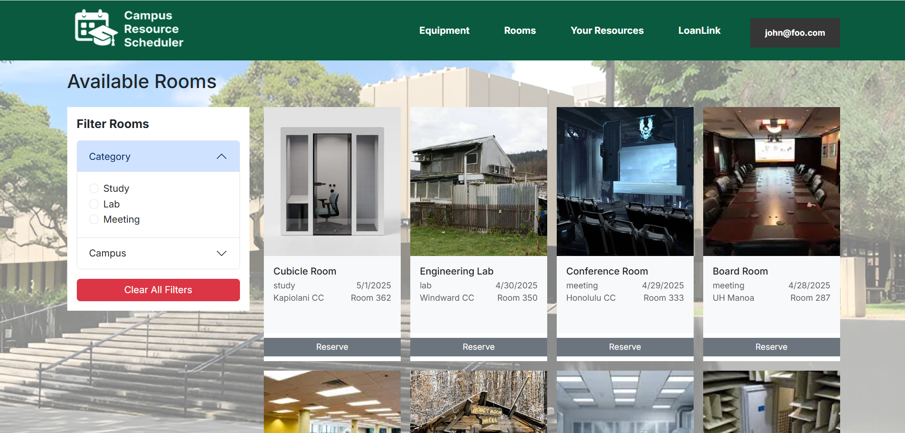

If the user wants to borrow a locational resource, clicking on the "Rooms" tab in the navbar will bring them to a page containing all available locational equipment. Each locational resource contains important information such as category, posted date, campus, and room. The user will also be able to filter the available locational equipment by campus and by category. To borrow a locational resource, the user can click the "Reserve" button the bottom of a resource box.

### Your Resources Page

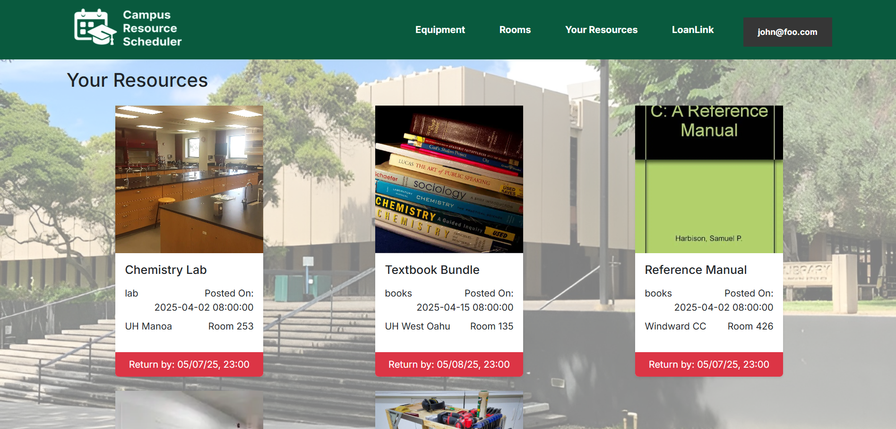

If the user wants to check what resources they have currently borrowed, clicking on the "Your Resources" tab in the navbar will bring them to a page containing all resources that they have borrowed, whether physical or locational. Each resource listed contains important information such as category, posted date, campus, room, and return deadline. The user will be able to return their specific resource by clicking the return by button on the bottom of a resource box.

### LoanLink Page

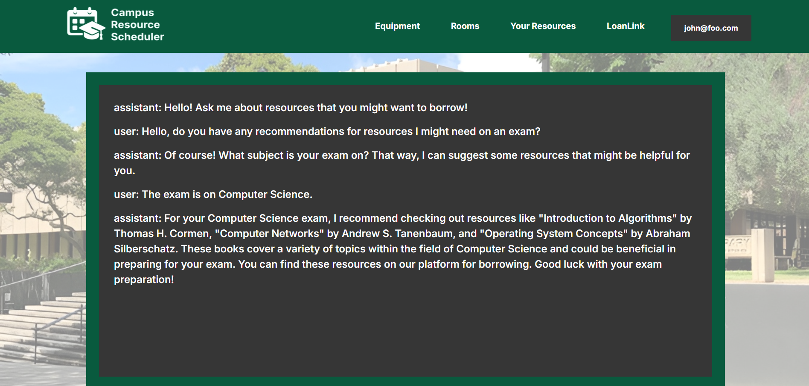

If the user wants to receive suggestions on what available resource best suits their needs, clicking on the "LoanLink" tab in the navbar will bring them to a page that allows them to send a text prompt to a AI chatbot. The chatbot will then respond with its own message directing the user to a available resource that fits the occasion based on the prompt and the user's profile.

### Profile Page

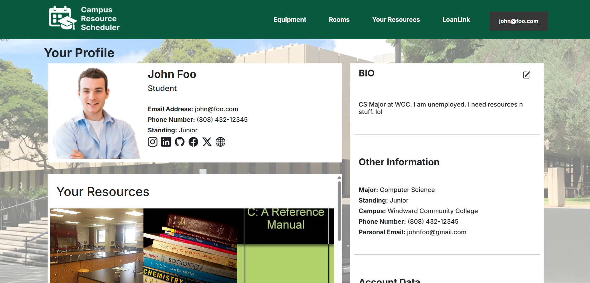

If the user wants to customize their profile, clicking on the box containing their email in the upper right corner of the page and then clicking "Profile" will bring them to their profile page. Here, the user can edit their profile and change their bio, major, standing, campus, phone number, and personal email address. This information will be private to that user only, and exists to help the LoanLink chatbot to generate a more relevant answer to any requests the user may have.

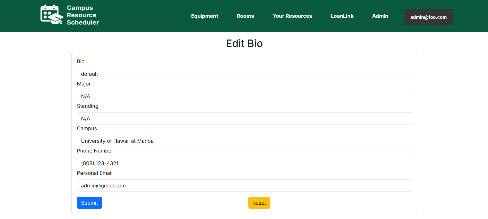

### Sign Out and Change Password Pages

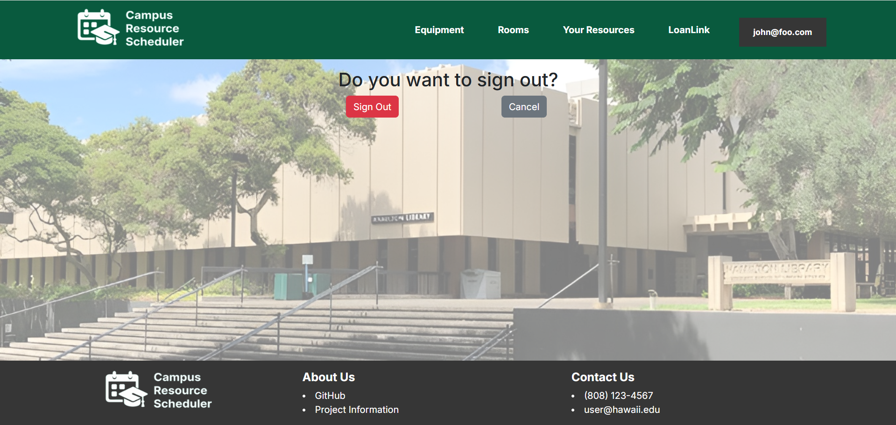

If the user wants to sign our of the website, clicking on the box containing their email in the upper right corner of the page and then clicking "Sign Out" will bring them to a page that will allow them to sign out.

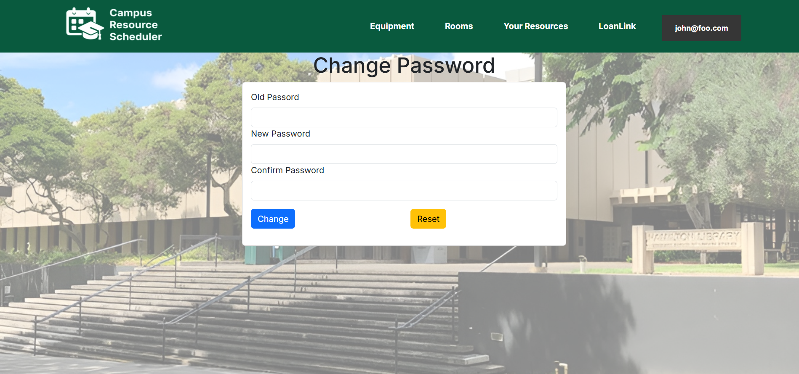

If the user wants to change their account password, clicking on the box containing their email in the upper right corner of the page and then clicking "Change Password" will bring them to a page that will allow them to change their password by inputting the user's old password and putting in a new password.

### Admin Home Page

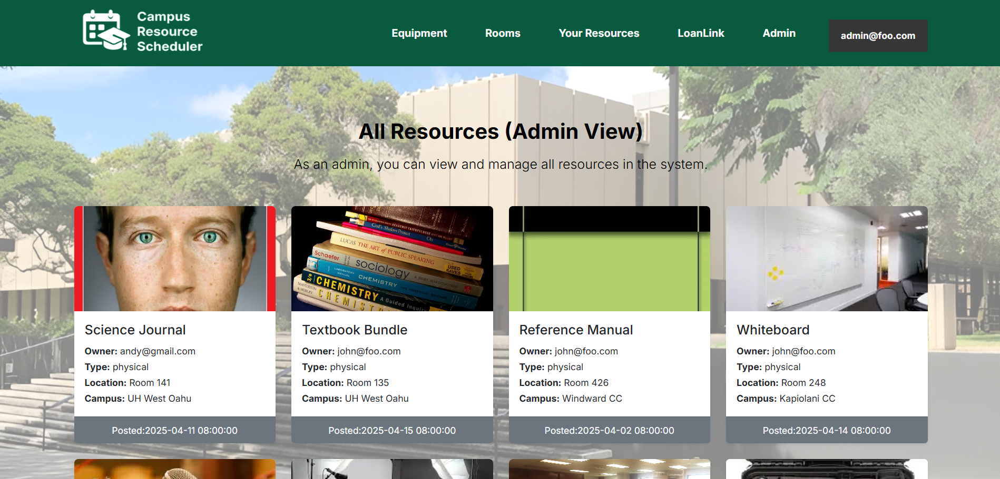

If the user has admin permissions, their home page will contain a list of all resources currently being borrowed by other users in the database along with each resource's relevant information such as owner, type, location, campus, and posted date.

### Configure Resources Page 

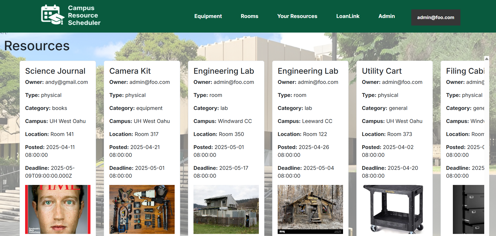

If the user has admin permissions, clicking on the "Admin" tab in the navbar will bring them to a page containing all the resources in the database. The user will then have an option to edit or delete each resource, as well as add new resources through a form. The changes will then be updated for every user in the system.

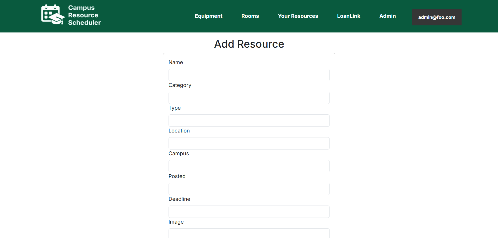

# Developer Guide

This section provides a developer guide on how to download, install, run, and modify the Campus Resource Scheduler application for personal use or as a basis for development tasks.

## Installation

First, [install PostgreSQL](https://www.postgresql.org/download/). Then create a database for your application.

```

$ createdb resources
Password:
$

```

Second, go to [https://github.com/campus-resource-scheduler-project/campus-resource-scheduler-project](https://github.com/campus-resource-scheduler-project/campus-resource-scheduler-project), and click the "Use this template" button. Complete the dialog box to create a new repository that you own that is initialized with this template's files.

Third, go to your newly created repository, and click the "Clone or download" button to download your new GitHub repo to your local file system. Using [GitHub Desktop](https://desktop.github.com/) is a great choice if you use MacOS or Windows.

Fourth, cd into the directory of your local copy of the repo, and install third party libraries with:

```

$ npm install

```

Fifth, create a `.env` file from the `sample.env`. Set the `DATABASE_URL` variable to match your PostgreSQL database that you created in the first step. See the Prisma docs [Connect your database](https://www.prisma.io/docs/getting-started/setup-prisma/add-to-existing-project/relational-databases/connect-your-database-typescript-postgresql). Then run the Prisma migration `npx prisma migrate dev` to set up the PostgreSQL tables.

```

$ npx prisma migrate dev
Environment variables loaded from .env
Prisma schema loaded from prisma/schema.prisma
Datasource "db": PostgreSQL database "<your database name>", schema "public" at "localhost:5432"

Applying migration `20240708195109_init`

The following migration(s) have been applied:

migrations/
└─ 20240708195109_init/
└─ migration.sql

Your database is now in sync with your schema.

✔ Generated Prisma Client (v5.16.1) to ./node_modules/@prisma/client in 51ms

$

```

Then seed the database with the `/config/settings.development.json` data using `npx prisma db seed`.

```

$ npx prisma db seed
Environment variables loaded from .env
Running seed command `ts-node --compiler-options {"module":"CommonJS"} prisma/seed.ts` ...
Seeding the database
Creating user: admin@foo.com with role: ADMIN
Creating user: john@foo.com with role: USER

🌱 The seed command has been executed.
$

```

## Running the system

Once the libraries are installed and the database seeded, you can run the application by invoking the "dev" script:

```

$ npm run dev

> nextjs-application-template-1@0.1.0 dev
> next dev

▲ Next.js 14.2.24

- Local: http://localhost:3000
- Environments: .env

✓ Starting...
✓ Ready in 1619ms

```

### Viewing the running app

If all goes well, the template application will appear at [http://localhost:3000](http://localhost:3000). You can login using the credentials in settings.development.json, or else register a new account.

### ESLint

You can verify that the code obeys standard coding standards by running ESLint over the code in the src/ directory with:

```
$ npm run lint

> nextjs-application-template-1@0.1.0 lint
> next lint

✔ No ESLint warnings or errors
$
```

### Directory structure

The top-level directory structure is:

```

.github # holds the GitHub Continuous Integration action and Issue template.

config/ # holds configuration files, such as settings.development.json

doc/ # holds developer documentation, user guides, etc.

prisma/ # holds the Prisma ORM schema and seed.ts files.

public/ # holds the public images.

src/ # holds the application files.

tests/ # holds the Playwright acceptance tests.

.eslintrc.json # The ESLint configuration.

.gitignore # don't commit VSCode settings files, node_modules, and settings.production.json

```

This structure separates documentation files (such as screenshots) and configuration files (such as the settings files) from the actual Next.js application.

The src/ directory has this structure:

```

app/

  admin/
    page.tsx # The Admin Page

  api/auth/[...nextauth]/
    route.ts # The NextAuth configuration

  auth/
    change-password/
      page.tsx # The Change Password Page

    signin/
      page.tsx # The Sign In Page

    signout/
      page.tsx # The Sign Out Page

    signup/
      page.tsx # The Sign Up / Register Page

  available-equipment/
    page.tsx # The Equipment Page

  available-rooms/
    page.tsx # The Rooms Page

  edit/
    page.tsx # The Edit User Form

  loanlink/
    page.tsx # The LoanLink Page

  not-authorized/
    page.tsx # The Not Authorized Page

  profile/
    page.tsx # The Profile Page

  resources/
    page.tsx # The Your Resources Page

  layout.tsx # The layout of the application

  page.tsx # The Landing Page

  providers.tsx # Session providers.

  components/
    AddResourceForm.tsx # The React Hook Form for adding resources.

    AvailableEquipment.tsx # The Equipment page.

    AvailableRooms.tsx # The rooms page.

    EditResourceForm.tsx # The Edit Resources Form.

    FilterSidebarEquipment.tsx # The sidebar filter for the Equipment page.

    FilterSidebarRooms.tsx # The sidebar filter for the Rooms page.

    Footer.tsx # The application footer.

    LoadingSpinner.tsx # Indicates working.

    Navbar.tsx # The application navbar.

    Popup.tsx # The Edit Profile form.

    YourResources.tsx # The Your Resources page.

  lib/

    authOptions.ts # Verifies user credentials from the database.

    dbActions.ts # Functions to manipulate the Postgres database.

    page-protections.ts # Functions to check for logged in users and their roles.

    prisma.ts # Singleton Prisma client.

    validationSchemas.ts # Yup schemas for validating forms.

  tests/ # playwright acceptance tests.

```

### Application functionality

The application implements a simple resources application for managing different resources for each user, which is a PostgreSQL table consisting of a
```
id        Int
name      String
category  String
type      String
owner     String
location  String
campus    String
image     String
posted    String
deadline  String?
```

The application also implements a PostgreSQL table for each user consisting of a
```
id       Int    
email    String 
password String
role     Role   
name     String
image    String
occupation String
bio      String
major    String
standing String
campus   String
phone    String
personal String
```

By default, each user only sees the resources that they own. However, the settings file enables you to define default accounts. If you define a user with the role "admin", then that user gets access to a special page which lists all the contacts defined by all users.

### CSS

The application uses the [React implementation of Bootstrap 5](https://react-bootstrap.github.io/). You can adjust the theme by editing the `src/app/globals.css` file. To change the theme override the Bootstrap 5 CSS variables.

```css
/* Change bootstrap variable values.
 See https://getbootstrap.com/docs/5.2/customize/css-variables/
 */
body {
  --bs-light-rgb: 236, 236, 236;
}

/* Define custom styles */
.gray-background {
  background-color: var(--bs-gray-200);
  color: var(--bs-dark);
  padding-top: 10px;
  padding-bottom: 20px;
}
```

### Routing

For display and navigation among its four pages, the application uses [Next.js App Router](https://nextjs.org/docs/app/building-your-application/routing).

Routing is defined by the directory structure.

### Authentication

For authentication, the application uses the NextAuth package.

When the database is seeded, a settings file (such as [config/settings.development.json](https://github.com/ics-software-engineering/nextjs-application-template/blob/main/config/settings.development.json)) is used to create users and contacts in the PostgreSQL database. That will lead to a default accounts being created.

The application allows users to register and create new accounts at any time.

### Authorization

Only logged in users can manipulate Contacts (but any registered user can manipulate any Contact, even if they weren't the user that created it.)

### Configuration

The config directory is intended to hold settings files. The repository contains one file: config/settings.development.json

The .gitignore file prevents a file named settings.production.json from being committed to the repository. So, if you are deploying the application, you can put settings in a file named settings.production.json and it will not be committed.

## Milestone 1 

You can access our Milestone 1 Dashboard here:

[https://github.com/orgs/campus-resource-scheduler-project/projects/1](https://github.com/orgs/campus-resource-scheduler-project/projects/1)

## Milestone 2

You can access our Milestone 2 Dashboard here:

[https://github.com/orgs/campus-resource-scheduler-project/projects/2](https://github.com/orgs/campus-resource-scheduler-project/projects/2)

## Milestone 3

You can access our Milestone 3 Dashboard here:

[https://github.com/orgs/campus-resource-scheduler-project/projects/4](https://github.com/orgs/campus-resource-scheduler-project/projects/4)

# Community Feedback

The following section contains community feedback from 5 UH community members who tested the Campus Resource Scheduler application's functionalities and capabilities. This is broken down into their general impression of the application, what they liked about the application, what they disliked about the application, and what how the application can be changed in order to make it better. 
Here are their responses:

### UH Community Member 1:

#### General Impressions:

Application is functional!

#### What they Liked:

The resources were easy to find, the filters in the Equipment and Rooms pages were helpful, the UI looked clean, the website was navigable, and the pictures were an added bonus.

#### What they Disliked:

The containers for each resource has too much clutter, and the time posted notation is not intuitive. The AI chatbot is currently not tailored towards the application. The categorites for equipment could be more discrete and clear. Overall, the website is a bit sluggish and the popups do not fit the website's asthetic.

#### What can be Improved:

Changes can be made to improve the individual components' UI and towards the AI chatbot to change it to be more in-line with the overall website.

### UH Community Member 2:

#### General Impressions:

The CRS has a clean design with good functionality.

#### What they Liked:

The website was easy and intuitive to use. The UI is visually appealing and it was easy to find what they were looking for.

#### What they Disliked:

There is no way to search for specific items.

#### What can be Improved:

There should be an option to select multiple things at the same time to add or remove. A search function would also be very helpful for searching specific resources.

### UH Community Member 3:

#### General Impressions:

Application with AI integration is functional!

#### What they Liked:

The different pictures for each resource were very amusing.

#### What they Disliked:

The notifications being a browser popup does not match the asthetic of the website. The AI is currently not very robust in helping users find specific resources.

#### What can be Improved:

A search functionality for specific resources would be very helpful if implemented.

### UH Community Member 4:

#### General Impressions:

The website and the navbar buttons are very functional and clean. The app itself applies to UH as a whole.

#### What they Liked:

The buttons were laid out in a very clear manner.

#### What they Disliked:

More instructions need to be added to the landing and user home pages, so the user undestands the functionality of the website.

#### What can be Improved:

Explanations on what each of the navbar buttons do needs to be added so that the first-time user can quickly and easily figure out what the application is for and how to use it.

### UH Community Member 5:

#### General Impressions:

Application is solid overall, but the background image was confusing as the application is for all UH campuses.

#### What they Liked:

The filter selection being at the forefront of the page made it helpful to guide users in the direction to find the correct resources. The LoanLink chatbot was also cool to use.

#### What they Disliked:

The "Your Resources" page on the website was unintuitive on how to return the items. It was also hard to find the profile section as a profile icon would be more suitable for accessing this page.

#### What can be Improved:

Headers could be used for wach college/institution to easily distinguish what location each resource is at rather than looking for the campus name at the bottom of each resource box.

## The Group Behind the Project

This is the group that developed the **Campus Resource Scheduler**.
- Arthur Acenas ([https://acenasa.github.io/](https://acenasa.github.io/))
- Eric Chae ([https://ericc808.github.io/](https://ericc808.github.io/))
- Sungwon Han ([https://hanswhan.github.io/](https://hanswhan.github.io/))
- Ralph Uy ([https://ralph-uy-aes.github.io/](https://ralph-uy-aes.github.io/))
- Zeyao Zhou ([https://zeyaoz.github.io/](https://zeyaoz.github.io/))
