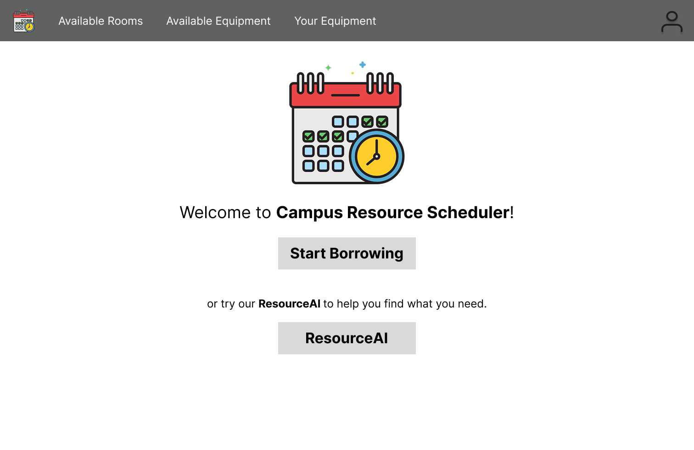
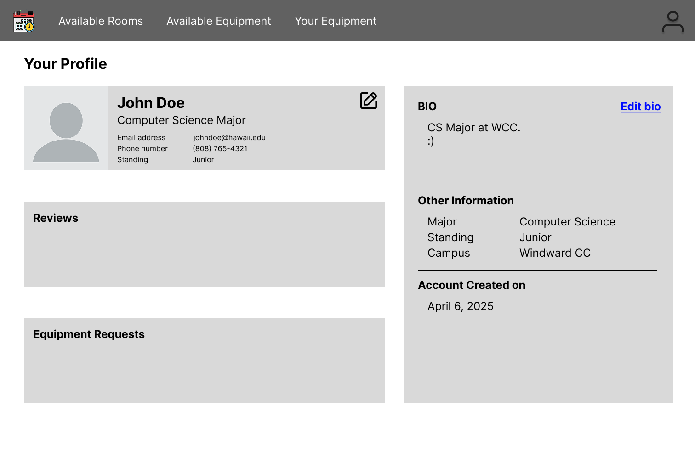
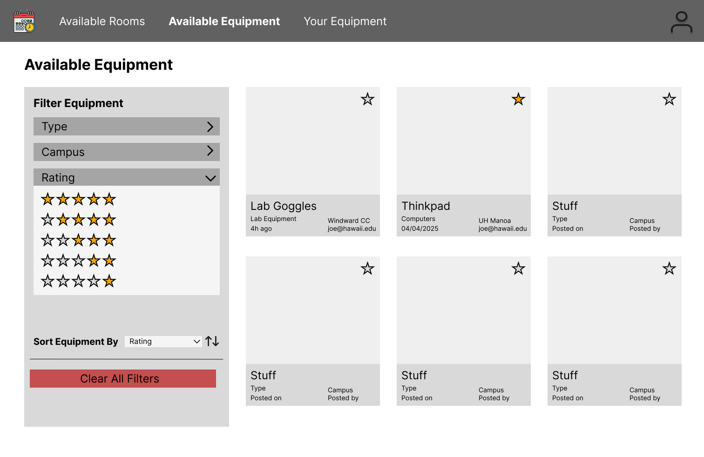
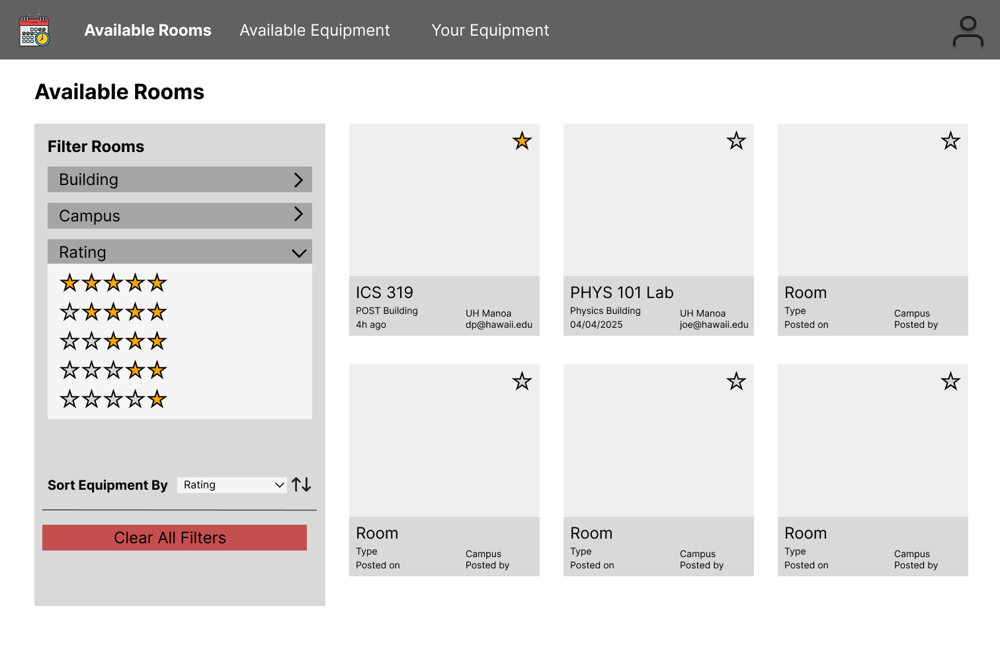
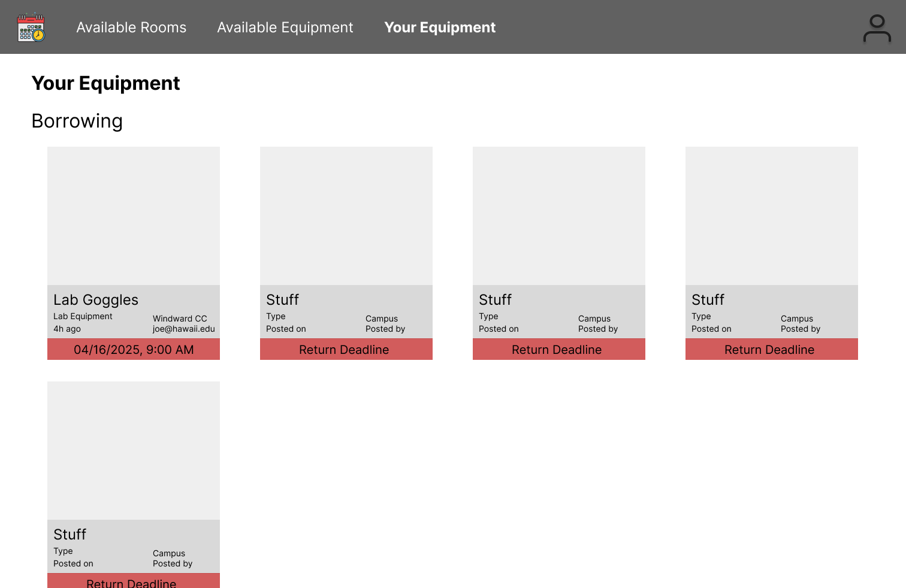

## Overview 

As a fellow student attending the University of Hawaiʻi at Mānoa, I have often wished for a piece of equipment I needed for one of my classes, a private room for a study group, or another student that could benefit from my old material used in past computer science classes. Glancing at the ideas proposed in the final project brainstorm outline, my group and I knew we could add a new fundamental website project designed to help UH Mānoa students obtain common campus resources. Therefore, we propose **Campus Resource Scheduler** as our final ICS 314 project.

### The Problem

As students attend their everyday classes at UH Mānoa, they may forget to bring an important piece of equipment once or twice, such as a mouse, earbuds, pencil, or even a laptop to a specific place. Students may also want specialized technology for a few important occasions such as a significant meeting, challenging recitation, or crucial exam, but do not know where to go to obtain them. Additionally, students may want a specialized room or lab to study, conduct work, or work on projects, but they cannot find such a place easily.

### The Solution

As a web project centered around the UH Mānoa community, the **Campus Resource Scheduler** seeks to solve these problems by providing a central hub where common campus resources, rooms, and labs can be lent out to those in need of these resources. Students can choose between what kind of resource they would like to receive for a set duration of time, regulated by the usage of accounts for authentication. Students will be able to see what resources and rooms are available or not as they access the website and return resources for community use.

## Special Sauce

As users decide what item to request or what room to schedule to fit their needs, an AI-powered algorithm can be added to recommend specific resources that are available to students. The user can also give the AI custom message requests and receive recommendations from that request. Using natural language processing and machine learning, the AI can process the user's custom message request and generate a response and recommendation based on that specific request. AI will also be able to gather information from the student's profile from profile creation, classify the user based on their profile, and generate a custom dashboard that displays available items/rooms for scheduling. The AI will only choose available resources, and also gives advice on how to use specific resources to users who may be considering scheduling the resources.

## The Group Behind the Project

This is the group that will be working on the **Campus Resource Scheduler**.
- Arthur Acenas ([https://acenasa.github.io/](https://acenasa.github.io/))
- Eric Chae ([https://ericc808.github.io/](https://ericc808.github.io/))
- Sungwon Han ([https://hanswhan.github.io/](https://hanswhan.github.io/))
- Ralph Uy ([https://ralph-uy-aes.github.io/](https://ralph-uy-aes.github.io/))
- Zeyao Zhou ([https://zeyaoz.github.io/](https://zeyaoz.github.io/))

## Mockup Page Ideas

This project will be structured similarly to a renting/borrowing website with a central authority that manages what items can be borrowed and who can borrow them. 

**Roles:** 
Users will be able to log into the website, browse the directory for resources that are relevant to them through a specialized search function, and reserve items or rooms for later pick up and use. 
Site Admins will be able to monitor the users that log into the website, see what resources they have used and borrowed, manage who can borrow what item, and add additional functionality to the website itself.

**Components:**
There will be 2 main categories for equipment and physical spaces. These 2 main categories will also have their own subcategories based on types such as electronics for equipment or labs for physical spaces. Users will be able to choose what specific resource they would like to schedule for a set amount of time and filter various resources based on relevance and availability. The users can receive confirmation messages and update them via their school email. Photos will be provided of all the resources for a friendlier user experience. Website administrators will be able to modify all of these components to fit the needs of the community, as well as make modifications based on real-life updates at UH Mānoa.

**Possible Mockup Pages:**
- Landing Page
- User Home Page
- User Profile Page
- Website Introduction Page
- Equipment Page
- Borrow Equipment Page
- Return Equipment Page
- Rooms/Labs Page
- Rent Rooms/Labs Page
- Return Rooms/Labs Page
- Admin Home Page
- Configure Resources Page

## Use Case Ideas

An end-to-end scenario of using the system:
- New user enters the landing page, sign up, log into the system, and set up their profile.
- New user learns how to use the site through a introductory page they encounter before scheduling resources.
- User searches for specific items/rooms based on their needs.
- User schedules item/room successfully and receives a confirmation message and instructions for pickup.
- Admin enters landing page, logs into the system, and monitors website activity.
- Admin modifies the availability of specific items/rooms based on current events.

## Page Mockups

The following 5 page mockups will display the main functionality of the application.

### Home Page:

**Campus Resource Scheduler** will have a home page displaying the main functions of the website: browsing available rooms, browsing available equipment, looking over the equipment a user has already borrowed, or conversing with the ResourceAI to find recommendations for helpful items for specific users. 

### Profile Page:

The profile page for each user can be customized to show their contact information, biography, home campus, class standing, resource reviews, and things they have borrowed. 

### Available Equipment Page:

The equipment page of the application is the central hub for all physical resources of the application. Here, users can browse what specific items they may need and also sort items based on relevance, campus, and rating.

### Available Rooms Page:

Like the equipment page, the rooms page is the central hub for all locational resources of the application, Here, users can browse what specific rooms they may need for their occasion and also sort rooms based on location, campus, and rating.

### Your Equipment Page:

This page is the informational panel for users who are currently borrowing physical equipment or in-person spaces at any particular campus. Here, users can see what resources they are borrowing, its type, and its return deadline. 
